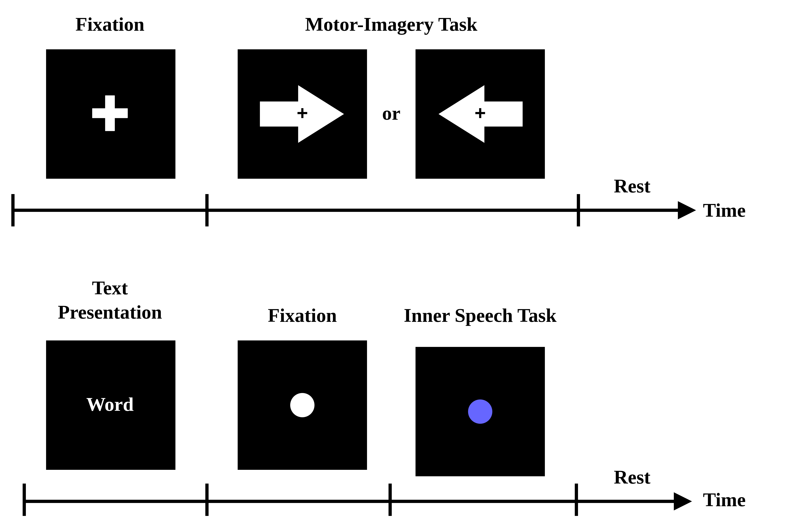

# 📊 Paper Datasets


## ⚙️ OpenBMI Dataset

**Source:** https://gigadb.org/dataset/100542

### 📁 Directory Structure
```
root/
├── subj01/
│ ├── sess01_subj01_EEG_MI.mat
│ └── sess02_subj01_EEG_MI.mat
├── ...
└── subj54/
│ ├── sess01_subj54_EEG_MI.mat
│ └── sess02_subj54_EEG_MI.mat
└── ...
```

---

## 🧠 BCI Competition 2020 - Track #3

**Source:** https://osf.io/pq7vb/overview  

### 📁 Directory Structure

```
root/
├── Test set/
│ ├── Data_Sample01.mat
│ ├── ...
│ └── Data_Sample15.mat
├── Training set/
│ ├── Data_Sample01.mat
│ ├── ...
│ └── Data_Sample15.mat
└── Validation set/
├── Data_Sample01.mat
├── ...
└── Data_Sample15.mat
```


---

## Experimental Paradigm

The MI and BTS paradigms follow a standard experimental protocol presented below. Each trial begins with a fixation interval, where a central symbol prepares the subject for the upcoming task. During the task execution, MI subjects perform an imagined grasping motion following a visual cue (right or left arrow), while BTS subjects imagine articulating a word (inner speech) presented prior to the fixation period. Each test ends with a rest interval. Multiple trials are performed using balanced classes.

