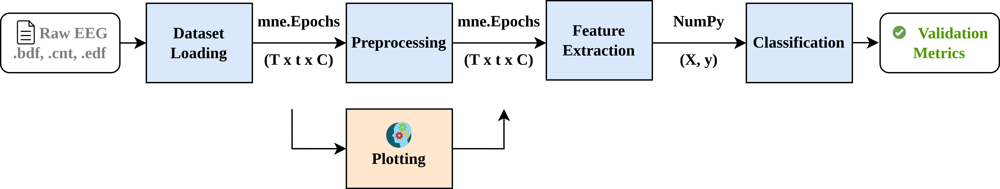

# EEG Framework Modules

This framework provides a modular, standardized environment for processing Motor Imagery (MI) and Brain-to-Speech (BTS) datasets. It is built upon the `MNE-Python` package and implements a `fit` & `transform` logic to ensure replicability and ease of use.  

## 1. Datasets

The framework handles non-structured raw EEG data (e.g., .bdf, .cnt, .edf) and transforms it into a structured (trial × time × channel) format using `mne.Epochs`.

* **Example Implementation:** See `datasets/openbmi_mi_example.py` for the OpenBMI loader. No Base class is required.
* **Key Functionality:** Extracting metadata (sampling frequency, channel labels) and synchronizing stimulus markers.  

## 2. Preprocessing

Standardized cleaning pipelines are executed sequentially on `mne.Epochs` objects.

* **Core Components:** `PreprocessingPipeline` (sequential flow) and `BaseStep` (abstract base class)` found in `preprocessing/preprocessing.py`.  
* **Steps Example:** For specific implementations examples, refer to `datasets/openbmi_mi_example.py` .  

## 3. Feature Extraction

This module transforms preprocessed `mne.Epochs` into a discriminative feature space represented as a NumPy array tuple $(X, y)$.   

* **Logic:** The pipeline converts $(trial \times time \times channel)$ data into $(n\_epochs, n\_features)$ for classification.  
* **Core Components:**: `FeaturePipeline` (sequential flow) and `BaseFeature (abstract base class)` found in `features/features.py`.  
* **Steps Example:** For specific implementations examples, refer to `features/features_example.py` .  

## 4. Models

This stage maps extracted characteristics to their respective class labels $(X \rightarrow y)$.

* **Estimator Support:** Compatible with a broad range of models, from traditional Machine Learning (SVM, Random Forest, Logistic Regression) to deep learning architectures. No Base class is required.
* **Step Example:** An EEGNet is implemented on `models/eegnet_examples.py`. 

## 5. Evaluate

This step receives the `test` data and the data `predicted by the model` and calculates validation metrics.

* **Step Example:** A simple validation is implemented on `evaluate/evaluate_example.py`. No Base class e required. 

## 6. Plotting

the plotting module interacts with any step maintaining the `mne.Epochs` format.

* **Step Example**: The average event related potential (ERP) per class is presented on `ploting/plotting_example.py`. No Base class is required.